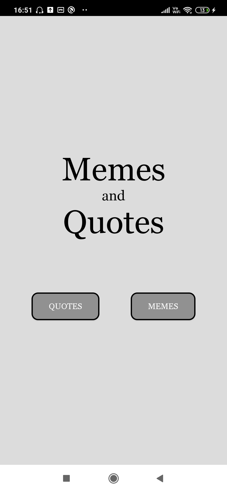
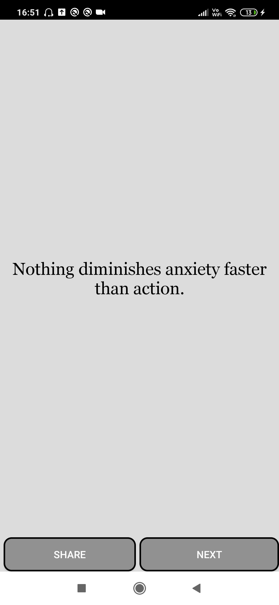
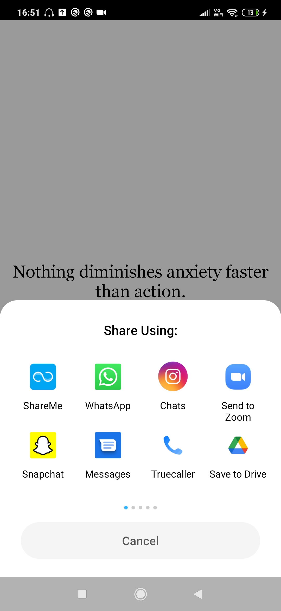

# MemesNQuotes
> This is a basic app capable of displaying Random memes picked up from Reddit & also quotes.
### Implementations :
This app has a very basic structure , using 3 activities : MenuActivity(Launcher) , RandomMemeActivity , RandomQuoteActivity.

The RandomMemeActivity displays random memes fetched from Reddit.I am fetching the JSON data of the Memes using an API. Making use of <b>Volley</b> library to do the networking and then using the <b>Picasso</b> library to display the image on the ImageView.

The RandomQuoteActivity is quite simple , again fetches the quote text in the form of JSON data using the <b>Volley</b> library and display it on the TextView.

Both of the above activities have the 'Next' and 'Share' options .

I gave it a very basic grey-black UI :P

#### Snapshots :

